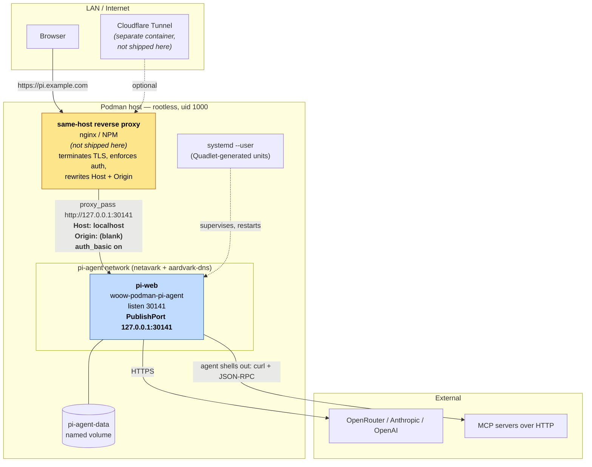
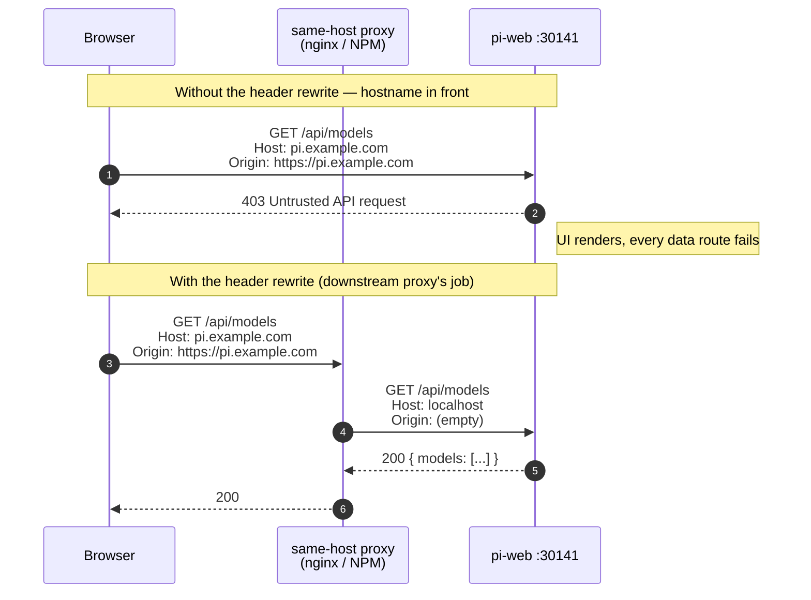
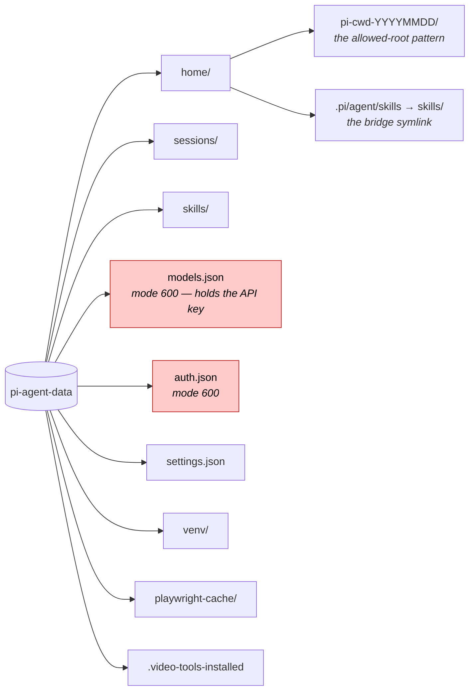
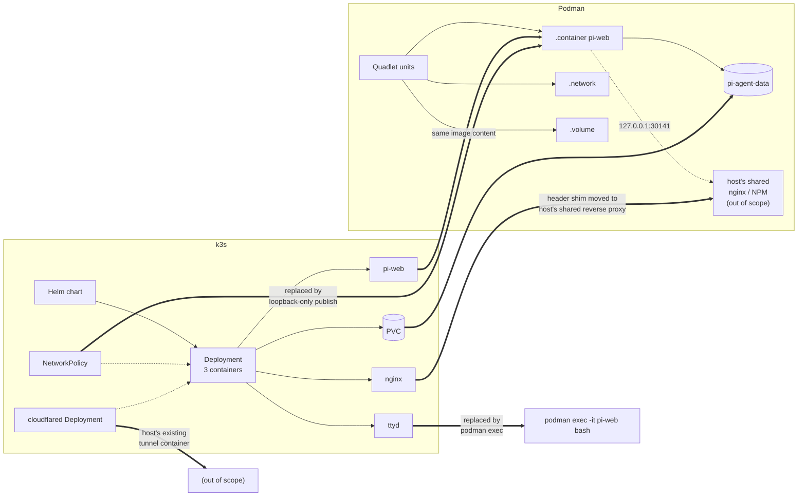

# Architecture

How the Podman deployment is put together, and why each piece is shaped the way it is. Where a decision differs from [the k3s deployment](https://github.com/WOOWTECH/Woow_k3s_pi_agent_package), the reason is stated rather than left as an unexplained divergence.

This document is the design. [VERIFICATION.md](VERIFICATION.md) is the measurement — what the deployment did when it was run, including the five defects that only appeared under a live workload.

---

## 1. Topology

One container on a private bridge, published to host loopback only. The
reverse proxy and the credential store live outside this repo — on the
shared same-host nginx / Nginx Proxy Manager that the deployment already
runs for its other services.



**pi-web publishes to loopback only.** `GET /api/models-config` returns
the configured provider API key **unredacted and unauthenticated** —
confirmed on a live deployment, not inferred. Widening `PublishPort` to
`0.0.0.0` puts a scrape target on the LAN. The only intended reachability
is via a proxy that lives on the same host, uses `127.0.0.1:30141`, and
has both Host/Origin rewriting and authentication in place. See
[docs/downstream-nginx.md](downstream-nginx.md) for that contract.

**Why the proxy is not in this repo.** An earlier revision shipped an nginx
sidecar with its own Basic auth (`scripts/set-password.sh`). That worked
in isolation but produced two credential stores — one here, one on the
shared reverse proxy the host already runs for every other service — and
two places to keep secure. Removing the sidecar leaves the deployment with
a single credential boundary, on the proxy the operator already maintains.
The trade-off is that a fresh deployment now has a mandatory external
configuration step; [docs/plans/2026-08-29-remove-nginx-sidecar.md](plans/2026-08-29-remove-nginx-sidecar.md) records the reasoning in full.

**A network, not a pod.** The k3s deployment put everything in one pod
because `ttyd` had to share `localhost` with pi-web. With ttyd gone
there is nothing to co-locate, and a plain bridge is simpler and more
portable — Podman 4.9 has no `.pod` Quadlet unit type, so a pod would
have meant hand-written unit files.

---

## 2. The trust guard — why a reverse proxy is mandatory

pi-web's `isApiRequestAllowed()` rejects:
- any `Host` that is not a loopback **name** or a **raw IP**, and
- any `Origin` that does not match the request.

Reaching the UI by raw LAN IP happens to satisfy the `Host` half on its
own. But the moment a **hostname** is involved — a Cloudflare Tunnel, a
reverse proxy, an internal DNS name — both halves fail, and every
auth-gated route answers `403 Untrusted API request`. The symptom is
distinctive and easy to misdiagnose: **the UI loads and renders, and then
does nothing.**



Both halves were measured, with identical headers: **200 through a
rewriting proxy, 403 sent directly at pi-web.** The 403 is the more
interesting number — it is what proves the rewrite is load-bearing rather
than decorative, and `tests/acceptance.sh` still asserts on it for that
reason even though the proxy itself is no longer part of this repo. A
regression that quietly relaxed the upstream check would let a downstream
proxy operator ship a working deployment without the rewrites and break
the moment upstream tightens the check again.

Nothing else can blank the `Origin` header. A tunnel's `httpHostHeader`
option covers `Host` only. That asymmetry is why the header rewrite is
non-negotiable, no matter which reverse proxy is used.

### Why the proxy is not shipped here

An earlier version of this repo bundled an nginx sidecar (`nginx.container`
+ `config/nginx.conf` + `scripts/set-password.sh`) that did exactly this
rewrite plus HTTP Basic auth. It was removed because every host that runs
this deployment already runs a same-host reverse proxy for its other
services, and duplicating that layer created two credential stores that
had to be kept in step.

The header rewrite is trivial to reproduce elsewhere; the maintenance cost
of a second nginx + a second password file was not. [docs/downstream-nginx.md](downstream-nginx.md)
is the contract that downstream must satisfy, with a plain-nginx sample
and an NPM sample; [docs/plans/2026-08-29-remove-nginx-sidecar.md](plans/2026-08-29-remove-nginx-sidecar.md)
records the reasoning and the migration path in full.

---

## 3. Boot sequence

```mermaid
sequenceDiagram
    autonumber
    participant SD as systemd --user
    participant C as pi-web container
    participant S as pi-web-start.sh
    participant V as pi-agent-data
    participant W as pi-web (node)

    SD->>C: start (TimeoutStartSec=900)
    C->>S: tini → pi-web-start.sh
    S->>S: umask 077
    S->>V: mkdir sessions/ skills/ home/
    S->>V: chmod 600 models.json, auth.json (repair pass)
    S->>S: HOME=/data/pi-agent/home, TZ=Asia/Taipei
    S->>V: symlink $HOME/.pi/agent/skills → /data/pi-agent/skills
    Note right of S: the skills bridge — without it,<br/>`pi install` succeeds and the skill<br/>never appears in a session
    alt video toolchain present and enabled
        S-->>V: background: venv + Playwright-Chromium + edge-tts (~720MB)
        Note right of V: does NOT gate startup;<br/>writes .video-tools-installed when done
    end
    S->>W: exec pi-web
    W-->>C: listening on 0.0.0.0:30141
    C->>C: HEALTHCHECK /api/home (start-period 120s)
    C-->>SD: healthy
```

`TimeoutStartSec=900` and `--start-period=120s` exist for the same reason: a cold volume plus the bootstrap can take minutes before `/api/home` answers, and neither systemd nor the healthcheck should give up during that window.

The `umask 077` is first for a reason. It is what makes the credential files private from birth; the chmod that follows only repairs volumes written by an older image. Ordering the other way round — repair first, umask later — is what the original version effectively did, and it left `models.json` at 0644 for the entire period it held an API key.

---

## 4. Persistence

One volume. Everything that must survive a container replacement lives under it, including `$HOME`.



**Pinning `HOME` into the volume** is what makes the CLI and the web UI agree on state. Left at `/root`, `pi install <skill>` from a shell would write inside the container's ephemeral layer and vanish on the next restart, while the UI kept reading the volume — an especially confusing failure, because the install reports success. The value is baked as image ENV rather than exported from `/etc/profile.d` alone, because profile.d reaches login shells only and `podman exec -it pi-web bash` is not one.

**Allowed cwd roots.** pi-web only accepts a working directory that is either an existing session's cwd or matches `^pi-cwd-\d{8}$` under `$HOME`. A fresh volume has neither, which is why `/api/models` answers `403` before any directory exists — that is normal fresh-install state, not a broken trust guard. The acceptance suite creates the dated directory before probing, precisely so this does not get misread as a failure.

---

## 5. The fixes that must not drift

The first two are carried identically by the k3s and Podman images — they are properties of the upstream packages, not of the runtime. The third is specific to this image, and is included here because it is the same class of mistake.

### The `pi` launcher

`@earendil-works/pi-coding-agent` is a **transitive** dependency of pi-web, so npm never links its `bin`. Without intervention there is no `pi` on `PATH` — every terminal workflow, every CLI-installed skill, and the whole TUI configuration path is simply dead. `rootfs/usr/local/bin/pi` resolves the nested `dist/cli.js` at runtime across four candidate paths with a `find` fallback, and the Containerfile asserts `pi --version` at build time so a layout change fails the build rather than shipping a broken image.

### The CJK path patch

Upstream `normalizeToolPath` folds U+00A0, U+2000–200A, U+202F, U+205F and **U+3000** to an ASCII space on every read, write and edit — and builds the read fallback chain from the already-folded path. Two consequences, both silent:

- a write to `台灣　報告.txt` (ideographic space) lands at `台灣 報告.txt` while reporting success;
- two files differing only by space type **cross-read** — you ask for one and get the other's contents.

For a zh-TW deployment this is data loss with a success message. `patches/fix-unicode-space-paths.mjs` handles both upstream shapes and asserts every hunk, so an upstream version bump fails the build instead of quietly dropping the fix. `tests/acceptance.sh` section 4 re-verifies it at runtime, because a patch that applied at build time and a patch that is live in the running image are not the same claim.

### The venv predicate

`video-tools-init.sh` judges an existing virtualenv by `bin/pip`, not by `bin/python3`. A venv whose ensurepip step failed — which is what happens on an image built with `VIDEO_TOOLS=0` — still has `bin/python3`. Testing that file made a half-built venv read as complete: creation was skipped, the next line called a pip that did not exist, the failure path exited 0, the sentinel was never written, and the identical sequence repeated on every boot with no way to recover short of deleting the tree by hand.

The general shape is worth naming, because all three fixes above are instances of it: **the obvious predicate is often not the one that determines whether the next step works.** `bin/python3` exists, `pi` is a declared dependency, a path is "the same path" after normalisation — each is true, and each is the wrong thing to check.

---

## 6. k3s ↔ Podman mapping



| Concern | k3s | Podman |
|---|---|---|
| Orchestration | Helm → Deployment | Quadlet → `systemd --user` |
| Shell access | ttyd sidecar on a published port | `podman exec` |
| Ingress restriction | `NetworkPolicy` limited to 30141/30142/7681 | pi-web publishes `127.0.0.1:30141` only; downstream proxy is host-local |
| Health | startup + readiness + liveness probes | one `HEALTHCHECK`, surfaced in `podman ps` |
| Storage | PVC (`local-path`) | named volume |
| Privilege | real root on the node | rootless; container root → host uid 1000 |
| Restart policy | `restartPolicy: Always` | `Restart=always` + `enable-linger` |
| External access | cloudflared sidecar + Cloudflare Access | the host's existing tunnel container |

`enable-linger` deserves a note: `systemd --user` services stop at logout and do not start at boot without it. This host's container runtime has restarted unprompted before; without lingering the stack would have stayed silently down afterwards.

The per-property acceptance comparison — which of these were actually exercised, and with what result — is in [VERIFICATION.md](VERIFICATION.md#3-k3s--podman-per-property).

---

## 7. What is not solved here

Honest boundaries, so nobody assumes coverage that does not exist. The last column separates what was observed on a running deployment from what is read from upstream code — both are real, but they are not equally strong claims.

| Gap | Where it lives | Consequence | Basis |
|---|---|---|---|
| No authentication in this repo | delegated to the downstream reverse proxy | If the proxy does not enforce auth, `127.0.0.1:30141` is a shell for anyone who reaches it | by construction — see [docs/downstream-nginx.md](downstream-nginx.md) |
| `/api/models-config` returns the key unredacted | upstream pi-web | Anything that reaches `127.0.0.1:30141` can read the provider key. The downstream proxy is what stops LAN callers from doing so. | **measured** — unauthenticated request, key in cleartext |
| No path confinement | upstream pi-coding-agent | The agent reads and writes anywhere the container user can | read from upstream |
| No approval gate / no `canUseTool` hook | upstream pi-coding-agent | No opportunity to intercept a tool call before it executes | read from upstream |
| No native MCP client (0.83.0) | upstream | MCP works only because the model drives the protocol by hand over `curl` | **measured** — full handshake completed, 38 tools listed |

The first is addressed by the downstream reverse proxy contract in [docs/downstream-nginx.md](downstream-nginx.md) — one instance of it is the host's existing Cloudflare Tunnel and Access. The rest are upstream properties and are listed so they are decided about rather than discovered.

The MCP row is worth reading twice. It passed — but it passed because the *model* implemented the protocol correctly on every call, not because the runtime did. That is a capability with a different failure mode: a weaker model does not produce a connection error, it produces a wrong answer.
